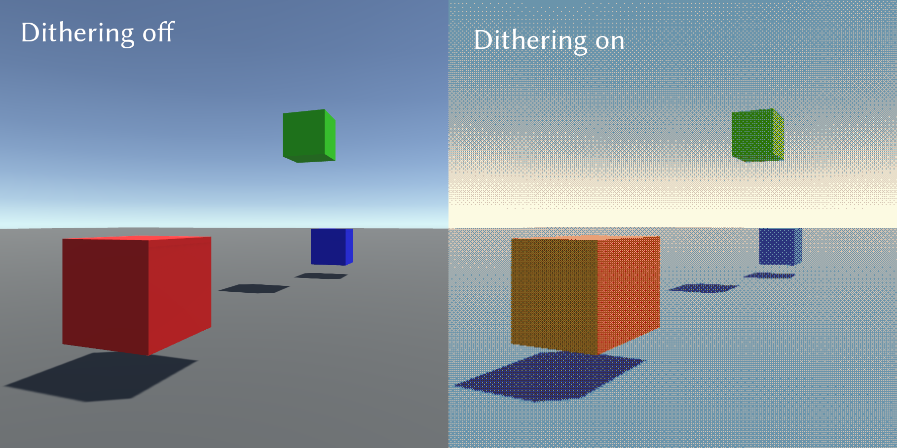

# Unity3D Dithering Effect

A simple dithering effect for the Unity engine using compute shaders.

Issues with gamma-correction have not been addressed.  The current method used
to select colours from the palette is very basic and does not provide best
results.
